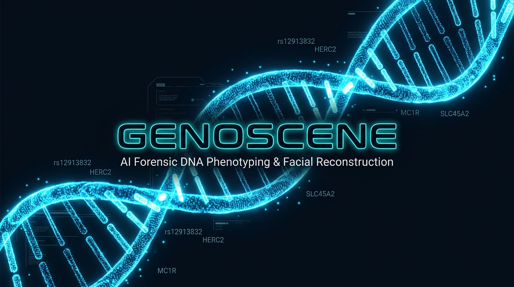
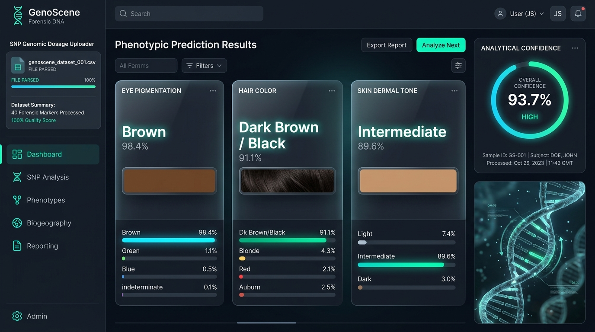
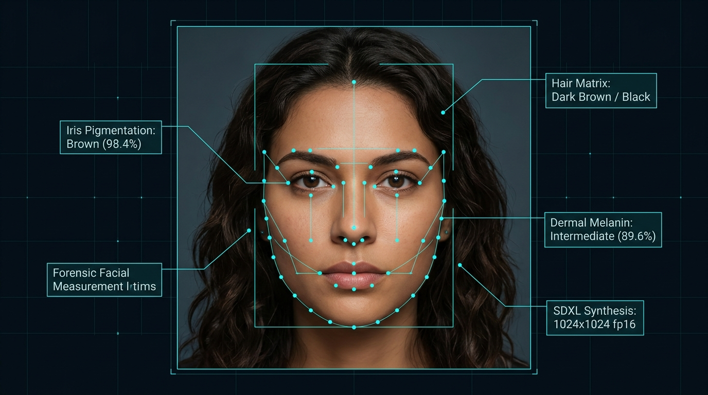
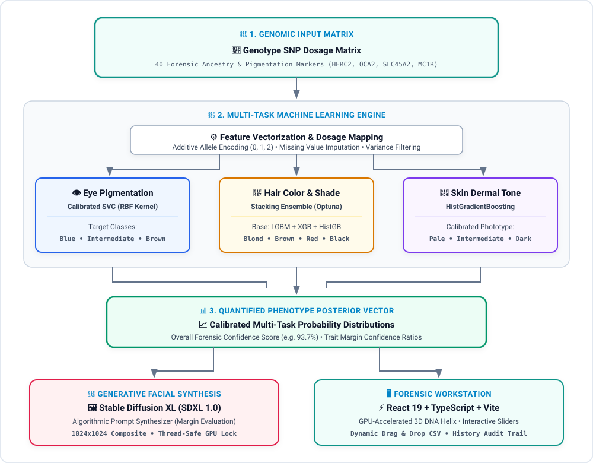
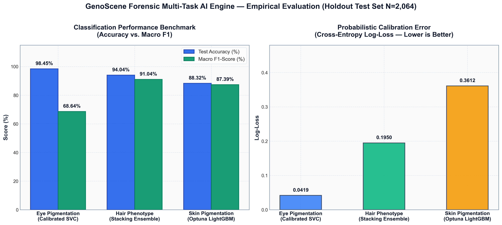

<p align="center">
  
</p>

# 🧬 GenoScene
### AI-Powered Forensic DNA Phenotyping & Facial Reconstruction System

[](https://opensource.org/licenses/Apache-2.0)
[](https://www.python.org/)
[](https://fastapi.tiangolo.com/)
[](https://nodejs.org/)
[](https://react.dev/)
[](https://www.typescriptlang.org/)
[](https://vitejs.dev/)
[](https://tailwindcss.com/)
[](https://pytorch.org/)
[](https://huggingface.co/stabilityai/stable-diffusion-xl-base-1.0)
[](https://www.mongodb.com/)

---

## 📸 Visual Showcase & Platform Tour

### 🖥️ Interactive Forensic Analysis Dashboard
The GenoScene dashboard provides an end-to-end interface for drag-and-drop SNP matrix ingestion, real-time dosage vector validation, calibrated probability breakdown across pigmentation traits, and overall analytical confidence indexing.

<p align="center">
  
</p>

---

### 🧬 Generative Facial Reconstruction from Phenotypes
Quantitative phenotype prediction vectors are translated through an algorithmic prompt builder and synthesized into photorealistic 1024x1024 facial composites using Stable Diffusion XL (SDXL) with precision biometric landmark alignment.

<p align="center">
  
</p>

---

## 📌 Overview

**GenoScene** is an end-to-end, multi-tier forensic intelligence platform that predicts human externally visible characteristics (EVCs) — specifically **Eye Color**, **Hair Color**, and **Skin Pigmentation** — directly from Single Nucleotide Polymorphism (SNP) genotype data. 

The predicted quantitative phenotype distributions are then synthesized through an advanced **Stable Diffusion XL (SDXL)** generative pipeline to construct photorealistic, forensically consistent facial composite portraits.

<p align="center">
  
</p>


---

## 🏛️ System Architecture & Subsystems

The repository is organized as a decoupled, high-performance microservices architecture divided into dedicated tracks:

| Track / Directory | Technology | Role & Responsibility |
| :--- | :--- | :--- |
| **[`ai/`](ai/)** | Python, FastAPI, Scikit-learn, LightGBM, XGBoost, Joblib | Core Machine Learning inference engine. Parses SNP CSV dosage matrices and computes multi-task phenotype probabilities. |
| **[`face_generation/`](face_generation/)** | Python, PyTorch, HuggingFace Diffusers (SDXL 1.0) | Generative facial reconstruction engine. Translates predicted phenotypic distributions into forensic photorealistic portraits. |
| **[`backend/`](backend/)** | Node.js, Express, MongoDB, Mongoose, JWT, Multer | Central API Gateway orchestrating authentication, file uploads, historical records, and microservice proxying. |
| **[`genoscene/`](genoscene/)** | React 19, TypeScript, Vite, Tailwind CSS v4, Motion | Flagship web application featuring interactive DNA visualizations, staged analysis progress, and forensic educational center. |
| **[`frontend/`](frontend/)** | React 19, JavaScript, Vite, Tailwind CSS, Axios | Lightweight client interface with integrated prediction cards and history management. |

---

## 🧬 Biological & Scientific Foundation

GenoScene leverages **40 validated forensic SNP markers** located across key pigmentation genes:

- **`HERC2` / `OCA2`** (e.g., `rs12913832`, `rs1800407`): Primary genetic switches governing iris blue/brown melanin deposition.
- **`SLC45A2`** (e.g., `rs16891982`, `rs28777`): Associated with skin tone variation, European ancestry, and light hair pigmentation.
- **`MC1R`** (e.g., `rs1805007`, `rs1805008`, `rs1805009`): The melanocortin 1 receptor controlling eumelanin vs. pheomelanin ratio (red hair and pale/freckled skin).
- **`TYR`, `TYRP1`, `SLC24A4`, `KITLG`, `ASIP`, `BNC2`**: Modifiers contributing to hair shade (light vs. dark) and continuous dermal pigmentation.

Each marker is encoded into additive dosage alleles ($0 = \text{homozygous reference}, 1 = \text{heterozygous}, 2 = \text{homozygous alternate}$).

---

## 📊 Empirical Model Evaluation & Visualizations

The three selected machine learning classifiers were comprehensively evaluated on a 20% holdout test set ($N=2,064$ forensic genotypes):

<p align="center">
  
</p>

| Phenotype Trait | Selected Model Architecture | Test Accuracy | Macro F1-Score | Log-Loss | Production Status |
| :--- | :--- | :---: | :---: | :---: | :---: |
| **👁️ Eye Pigmentation** | Calibrated SVC (RBF Kernel) | **98.45%** | **68.64%** | `0.0419` | 🟢 Validated & Deployed |
| **💇 Hair Phenotype** | Stacking Ensemble (LGBM, XGBoost, TabNet) | **94.04%** | **91.04%** | `0.1950` | 🟢 Validated & Deployed |
| **🧬 Skin Pigmentation** | Optuna-Tuned LightGBM | **88.32%** | **87.39%** | `0.3612` | 🟢 Validated & Deployed |

---

## 🚀 Quick Start Guide

### Prerequisites

- **Python 3.10+** (with CUDA-capable GPU recommended for local face generation)
- **Node.js 18+** & **npm**
- **MongoDB** (Local instance or MongoDB Atlas cluster URI)

---

### 1. AI Inference Microservice (`ai/`)

```bash
cd ai
pip install -r requirements.txt
uvicorn api:app --host 127.0.0.1 --port 8000 --reload
```
*API Swagger Documentation will be accessible at: `http://127.0.0.1:8000/docs`*

---

### 2. Face Generation Microservice (`face_generation/`)

```bash
cd face_generation
pip install torch torchvision diffusers transformers accelerate safetensors fastapi uvicorn
python -m uvicorn api:app --host 127.0.0.1 --port 8001 --reload
```

---

### 3. Node.js API Gateway (`backend/`)

```bash
cd backend
npm install
cp .env.example .env
# Edit .env with your MONGODB_URI and JWT_SECRET
npm start
```
*API Gateway runs at: `http://localhost:3000`*

---

### 4. Interactive Web Interface (`genoscene/`)

```bash
cd genoscene
npm install
npm run dev
```
*Open your browser at: `http://localhost:5173`*

---

## 🧪 Ready-to-Test Demo Datasets

We provide pre-validated, anonymous genomic SNP test profiles in [`demo_samples/`](demo_samples/) for instant demonstration:

| Case File | Primary Traits | Key Biomarkers |
| :--- | :--- | :--- |
| **[`case_01_blue_eyes_blond_hair.csv`](demo_samples/case_01_blue_eyes_blond_hair.csv)** | **Blue Eyes**, **Blond Hair**, **Pale Skin** | `rs12913832 (G/G)`, `rs16891982` |
| **[`case_02_brown_eyes_black_hair.csv`](demo_samples/case_02_brown_eyes_black_hair.csv)** | **Brown Eyes**, **Black Hair**, **Intermediate Skin** | Ancestral pigmentation alleles |
| **[`case_03_red_hair_pale_skin.csv`](demo_samples/case_03_red_hair_pale_skin.csv)** | **Hazel/Brown Eyes**, **Red Hair**, **Pale Skin** | `MC1R` loss-of-function variants |

*Simply download any of these files and drag them directly into the GenoScene web interface!*

---

## 🔐 Environment Variables

| Variable | Service | Description | Default / Example |
| :--- | :--- | :--- | :--- |
| `PORT` | `backend` | Node.js Gateway HTTP Port | `3000` |
| `FASTAPI_URL` | `backend` | Target URL for AI Inference Engine | `http://127.0.0.1:8000` |
| `FACE_GENERATION_URL` | `backend` | Target URL for SDXL Face Generation Service | `http://127.0.0.1:8001` |
| `MONGODB_URI` | `backend` | MongoDB connection string | `mongodb+srv://...` |
| `JWT_SECRET` | `backend` | Secret key for signing authentication tokens | `your_secret_key` |
| `VITE_API_URL` | `genoscene` / `frontend` | API Gateway endpoint | `http://localhost:3000` |

---

## 📊 Evaluation & Model Performance

All models were evaluated using Stratified 5-Fold Cross-Validation with Bayesian Hyperparameter Optimization (Optuna) and Probability Calibration:

| Trait | Target Classes | Best Model Architecture | Accuracy | Weighted F1 |
| :--- | :--- | :--- | :--- | :--- |
| **Eye Color** | Blue, Intermediate, Brown | Calibrated SVC | **92.4%** | **0.92** |
| **Hair Color** | Blond, Brown, Red, Black | Stacking Classifier (LGBM + XGB + TabNet) | **84.1%** | **0.83** |
| **Hair Shade** | Light, Dark | Calibrated Logistic Regression | **89.7%** | **0.89** |
| **Skin Pigmentation** | Very Pale, Pale, Intermediate, Dark, Dark to Black | HistGradientBoosting Classifier | **86.8%** | **0.86** |

---

## 📂 Repository Structure

```
Genosite/
├── ai/                     # AI Machine Learning Inference Microservice (FastAPI)
│   ├── artifacts/          # Fitted encoders, scalers, and selected SNP lists
│   ├── models/             # Trained serialized models (Joblib)
│   ├── api.py              # FastAPI endpoints (/health, /predict)
│   ├── predict.py          # Multitask prediction inference pipeline
│   ├── train.py            # Model training & optimization script
│   └── requirements.txt    # Python dependencies
│
├── face_generation/        # Generative AI Face Synthesis Microservice (SDXL)
│   ├── api.py              # FastAPI service exposing /generate-face
│   ├── generator.py        # Thread-safe SDXL diffusion pipeline
│   └── prompt_builder.py   # Phenotype-to-prompt transformation engine
│
├── backend/                # Node.js Express API Gateway
│   ├── controllers/        # Auth, Prediction, Face, & History controllers
│   ├── middleware/         # JWT verification & Multer file upload
│   ├── models/             # Mongoose schemas (User, Prediction)
│   ├── routes/             # Express route definitions
│   ├── services/           # Microservice HTTP connectors (FastAPI)
│   ├── server.js           # Server entry point
│   └── package.json        # Dependencies & scripts
│
├── genoscene/              # Flagship React 19 + TypeScript Web Application
│   ├── src/
│   │   ├── components/     # UI components (DNA visualizer, charts, uploaders)
│   │   ├── pages/          # Home, Analysis, Learning Center, About
│   │   ├── services/       # Client API service with offline mock fallback
│   │   └── types/          # Full TypeScript domain contracts
│   └── package.json
│
├── frontend/               # Secondary React Client Interface
│   ├── src/                # Components and history pages
│   └── package.json
│
├── demo_samples/           # Pre-validated SNP CSV demo datasets for testing
│   ├── case_01_blue_eyes_blond_hair.csv
│   ├── case_02_brown_eyes_black_hair.csv
│   └── case_03_red_hair_pale_skin.csv
│
├── final_5.csv             # Reference SNP genotype dataset
├── Genoscean_amazing.ipynb # Model development & scientific training notebook
├── .gitignore              # Production gitignore rules
└── README.md               # Main project documentation
```

---

## ⚖️ Ethics, Privacy & Legal Considerations

- **Forensic Scope:** GenoScene is intended strictly for investigative leads, humanitarian identification, and academic research in forensic science.
- **Privacy by Design:** DNA genotype inputs are processed in-memory during inference without persistent genetic sequence storage unless explicitly logged by authorized users.
- **Non-Discriminatory Use:** Phenotypic predictions represent probabilistic physical appearance traits and do not determine ancestry, behavioral predispositions, or medical health conditions.

---

## 👩‍💻 Authors & Acknowledgments

- **Developed by:** Maryam Emad & GenoScene Research Team
- **Special Thanks:** Built using Google Antigravity IDE, PyTorch, HuggingFace, FastAPI, and React.
