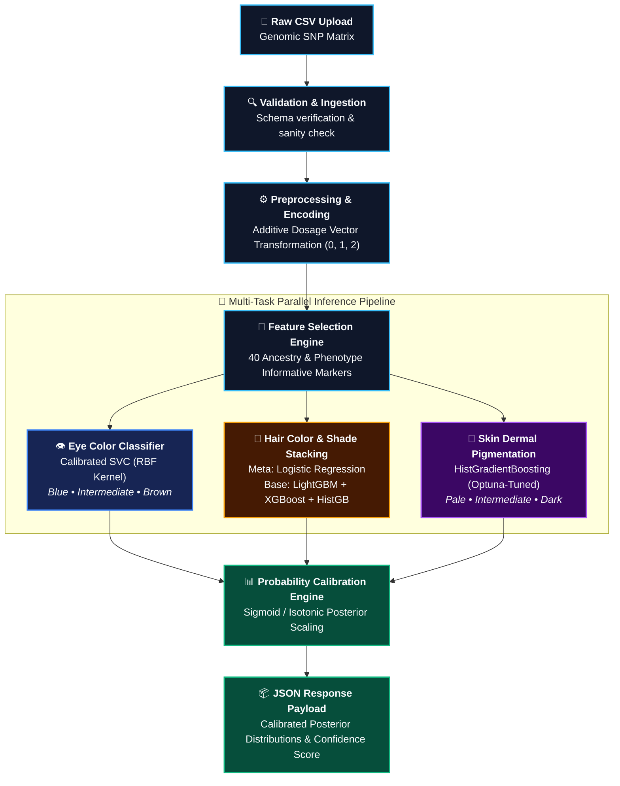

# 🧠 GenoScene AI Engine
### Multi-Task Phenotypic Inference & Machine Learning Microservice

The **GenoScene AI Engine** is a high-throughput, low-latency FastAPI microservice dedicated to predicting human physical traits (Externally Visible Characteristics — EVCs) from Single Nucleotide Polymorphism (SNP) genotype matrices.

---

## 🔬 Core Capabilities

- **Multi-Task Prediction**: Simultaneous estimation of:
  - **Eye Color**: Blue, Brown, Intermediate
  - **Hair Color**: Blond, Brown, Red, Black
  - **Hair Shade**: Light, Dark
  - **Skin Pigmentation**: Very Pale, Pale, Intermediate, Dark, Dark to Black
- **Calibrated Probabilities**: Outputs true posterior probability vectors for every predicted category alongside overall confidence ratings.
- **Robust Feature Pipeline**: Handles missing data, variant encoding, and verifies expected 40 forensic SNP allele dosage markers (0, 1, 2).

---

## 🏗️ Architecture & Model Design



### Models & Artifacts

| Trait | Model Family | Key Hyperparameters & Tuning | Artifact Files |
| :--- | :--- | :--- | :--- |
| **Eye Color** | Support Vector Classifier (`SVC`) | Sigmoid Probability Calibration, RBF Kernel | `models/Eye_model.joblib`<br>`artifacts/Eye_artifacts.joblib` |
| **Hair Color** | Stacking Ensemble (`StackingClassifier`) | Base learners: LightGBM, XGBoost, HistGradientBoosting; Meta-learner: LogisticRegression | `models/Hair_model.joblib`<br>`artifacts/Hair_artifacts.joblib` |
| **Skin Tone** | `HistGradientBoostingClassifier` | Optuna Bayesian Tuned, Class-Weight Balanced | `models/Skin_model.joblib`<br>`artifacts/Skin_artifacts.joblib` |
| **Feature Set** | 40 Forensic SNPs | Variance thresholding & ancestry-informative marker alignment | `artifacts/selected_snps.joblib` |

---

## 📡 API Reference

### 1. Health Check
- **Endpoint**: `GET /health`
- **Response**:
```json
{
  "status": "ok"
}
```

### 2. Phenotype Prediction
- **Endpoint**: `POST /predict`
- **Content-Type**: `multipart/form-data`
- **Payload**: `file` (CSV file containing SNP dosage rows)
- **Response Structure**:
```json
{
  "Eye": {
    "Top": "Brown",
    "Probabilities_%": {
      "Brown": 98.42,
      "Intermediate": 1.25,
      "Blue": 0.33
    }
  },
  "Hair": {
    "Top": "Black",
    "Probabilities_%": {
      "Black": 91.10,
      "Brown": 7.40,
      "Blond": 1.10,
      "Red": 0.40
    }
  },
  "Hair_Shade": {
    "Top": "Dark",
    "Probabilities_%": {
      "Dark": 95.80,
      "Light": 4.20
    }
  },
  "Skin": {
    "Top": "Intermediate",
    "Probabilities_%": {
      "Intermediate": 89.60,
      "Pale": 8.20,
      "Very Pale": 1.50,
      "Dark": 0.60,
      "Dark to Black": 0.10
    }
  },
  "Overall_Confidence_%": 93.73
}
```

---

## 🛠️ Setup & Running

### Requirements
- Python 3.10, 3.11, or 3.13
- Dependencies specified in `requirements.txt`:
  - `fastapi`
  - `uvicorn`
  - `pandas`
  - `numpy`
  - `scikit-learn`
  - `xgboost`
  - `lightgbm`
  - `joblib`
  - `python-multipart`

### Installation

```bash
# Navigate to the ai track
cd ai

# Install dependencies
pip install -r requirements.txt

# Start the FastAPI server
uvicorn api:app --host 127.0.0.1 --port 8000 --reload
```

---

## 📁 File Structure

```
ai/
├── artifacts/              # Preprocessing encoders and selected SNP feature names
│   ├── Eye_artifacts.joblib
│   ├── Hair_artifacts.joblib
│   ├── Skin_artifacts.joblib
│   └── selected_snps.joblib
├── models/                 # Serialized production machine learning models
│   ├── Eye_model.joblib
│   ├── Hair_model.joblib
│   └── Skin_model.joblib
├── api.py                  # FastAPI service entry point
├── fast_test.csv           # Sample SNP genotype file for quick testing
├── feature_engineering.py  # Feature transformation logic
├── feature_selection.py    # SNP variance and correlation filtering
├── predict.py              # Standalone inference functions
├── preprocessing.py        # Genotype matrix encoding & scaling
├── requirements.txt        # Python package dependencies
├── test.ps1                # Automated endpoint test script
└── train.py                # Full training, CV evaluation, and model serialization
```
