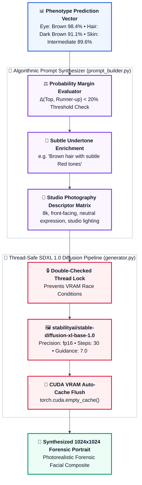

# 🎨 GenoScene Face Generation Engine
### Generative Forensic Facial Reconstruction using Stable Diffusion XL (SDXL)

<p align="center">
  
</p>

The **GenoScene Face Generation Engine** transforms discrete and probabilistic phenotypic traits (eye color, hair pigmentation, skin dermal tones) into hyper-realistic, photorealistic forensic facial portraits using state-of-the-art latent diffusion models.

---

## 🌟 Key Features

- **Algorithmic Prompt Synthesizer (`prompt_builder.py`)**:
  - Dynamically evaluates probability margins between dominant and runner-up traits.
  - Automatically captures subtle phenotypic undertones (e.g., *"Brown hair with subtle Red tones"*) when secondary traits exceed probability threshold criteria.
  - Generates studio-grade portrait photography prompts enforcing neutral lighting, front-facing orientation, and natural human skin texture.
- **Thread-Safe SDXL Pipeline (`generator.py`)**:
  - Implements the Double-Checked Locking singleton pattern to avoid redundant multi-gigabyte model allocations in GPU VRAM.
  - Sequential inference queue preventing Out-Of-Memory (OOM) race conditions.
  - Automatic VRAM cache flushing (`torch.cuda.empty_cache()`) post-generation.
- **RESTful Service (`api.py`)**:
  - Exposes a clean FastAPI interface ready for integration with the central Node.js API Gateway or direct client access.

---

## 🏗️ Technical Pipeline



---

## 📡 API Endpoints

### 1. Health Status
- **Method**: `GET /health`
- **Response**: `{"status": "ok", "service": "face-generation"}`

### 2. Generate Face
- **Method**: `POST /generate-face`
- **Request Body**:
```json
{
  "Eye": {
    "Top": "Brown",
    "Probabilities_%": { "Brown": 98.5, "Blue": 1.5 }
  },
  "Hair": {
    "Top": "Black",
    "Probabilities_%": { "Black": 92.0, "Brown": 8.0 }
  },
  "Skin": {
    "Top": "Intermediate",
    "Probabilities_%": { "Intermediate": 90.0, "Pale": 10.0 }
  }
}
```
- **Response**:
```json
{
  "status": "success",
  "prompt": "A photorealistic portrait photograph of an adult human...",
  "image_url": "/generated/face_1727800000.png"
}
```

---

## 🚀 Setup & Execution

### Prerequisites
- Python 3.10+
- **NVIDIA GPU** with CUDA support and at least 8 GB VRAM (Recommended for SDXL 1.0).
- *Note: In resource-constrained environments, you can run this microservice on Google Colab or Kaggle with a T4/A100 GPU and tunnel via Ngrok.*

### Dependencies Installation
```bash
cd face_generation
pip install torch torchvision --index-url https://download.pytorch.org/whl/cu121
pip install diffusers transformers accelerate safetensors fastapi uvicorn
```

### Running the Microservice
```bash
python -m uvicorn api:app --host 127.0.0.1 --port 8001 --reload
```

---

## 📁 Track Structure

```
face_generation/
├── api.py              # FastAPI HTTP interface
├── generator.py        # SDXL loading and inference execution
├── prompt_builder.py   # Trait-to-prompt transformation engine
├── test_generator.py   # Standalone GPU synthesis verification script
└── test_prompt.py      # Unit test for prompt builder logic
```
